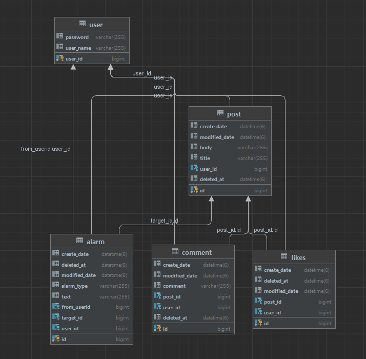

# SNS 백엔드 제작

# 📢 개인 SNS API 프로젝트

**회원가입, 로그인, 피드, 댓글, 좋아요, 알림 기능을 구현한 SNS API입니다.**

## 🚧 실행 방법

**Environment Variable에 아래의 환경변수를 설정하고 실행합니다.**

| 환경 변수 명 | 예제 |
| --- | --- |
| DB_HOST | jdbc:mysql://주소:3306/스키마 이름 |
| DB_USER | root |
| DB_PASSWORD | password |
| KEY | key |

## 📃 Swagger

[Swagger UI](http://ec2-43-200-170-83.ap-northeast-2.compute.amazonaws.com:8080/swagger-ui/)

## 🏃 EndPoints

| 구분 | Method | URL | Description | 참고 |
| --- | --- | --- | --- | --- |
| 회원 | POST | /api/v1/users/join | 회원가입 |  |
|  | POST | /api/v1/users/login | 로그인 | 로그인시 토큰 발행 |
| 포스트 | GET | /api/v1/posts | 포스트 목록 조회 | Page(최신순, 20개씩) |
|  | GET | /api/v1/posts/{id} | 포스트 상세 조회 |  |
|  | POST | /api/v1/posts | 포스트 작성 | 로그인 후 이용 가능 |
|  | PUT | /api/v1/posts | 포스트 수정 | 본인 또는 ADMIN 권한 필요 |
|  | DELETE | /api/v1/posts/{id} | 포스트 삭제 | 본인 또는 ADMIN 권한 필요 |
| 댓글 | GET | /api/v1/posts/{postId}/comments[?page=0] | 댓글 조회 | 회원, 비회원 접근 가능, Page(최신순, 10개씩) |
|  | POST | /api/v1/posts/{postId}/comments | 댓글 작성 | 로그인 후 이용 가능 |
|  | PUT | /api/v1/posts/{postId}/comments/{id} | 댓글 수정 | 로그인 후 이용 가능 |
|  | DELETE | /api/v1/posts/{postId}/comments/{id} | 댓글 삭제 | 로그인 후 이용 가능 |
| 좋아요 | POST | /posts/{postId}/likes | 좋아요 누르기 | 로그인 후 이용 가능, 중복으로 누를 경우 취소 |
|  | GET | /posts/{postId}/likes | 좋아요 개수 리턴 | 좋아요 개수를 리턴 |
| 마이피드 | GET | /posts/my | 마이피드 조회 | 자신이 작성한 글만 보이는 기능 |
| 알림 | GET | /alarms | 알람 리스트 조회 | 포스트에 댓글, 좋아요가 달리면 알림이 등록 |

## ❗에러 코드

| 에러 코드 | 설명 | HTTP status |
| --- | --- | --- |
| DUPLICATED_USER_NAME | 중복된 아이디로 가입을 요청한 경우 | 409 |
| USERNAME_NOT_FOUND | 가입되지 않은 아이디로 요청한 경우 | 404 |
| INVALID_PASSWORD | 비밀번호가 틀린 경우 | 401 |
| INVALID_TOKEN | 유효하지 않은 토큰으로 요청한 경우 | 401 |
| INVALID_PERMISSION | 해당 API에 대한 요청 권한이 없는 경우, 올바르지 않은 헤더로 요청한 경우, 게시글에 대한 수정/삭제 권한이 없는 경우 | 401 |
| POST_NOT_FOUND | 존재하지 않는 게시물을 요청한 경우 | 404 |
| DB_ERROR | DB와의 연결이 이상인 경우 | 500 |
| INTERNAL_SERVER_ERROR | 서버에서 요청 처리 중 오류가 발생한 경우 | 500 |
| INVALID_VALUE | 지원하지 않는 포맷 입력 | 400 |
| COMMENT_NOT_FOUND | 존재하지 않는 댓글을 요청한 경우 | 404 |
| EXPIRE_TOKEN | 토큰이 만료된 경우 | 401 |

## 📄 개발환경

- **Java 11**
- **Build** : Gradle 7.5.1
- **Framework** : Springboot 2.7.5
- **Database** : MySQL 8.0
- **CI & CD** : GitLab
- **Server** : AWS EC2
- **Deploy** : Docker
- **IDE** : IntelliJ

## 💰 라이브러리

```groovy
dependencies {
	implementation 'org.springframework.boot:spring-boot-starter-data-jpa'
	implementation 'org.springframework.boot:spring-boot-starter-mustache'
	implementation 'org.springframework.boot:spring-boot-starter-web'
	//스웨거
	implementation "io.springfox:springfox-boot-starter:3.0.0"
	implementation "io.springfox:springfox-swagger-ui:3.0.0"
	//시큐리티
	implementation 'org.springframework.boot:spring-boot-starter-security'
	implementation 'org.springframework.security:spring-security-test:5.7.3'
	implementation 'io.jsonwebtoken:jjwt:0.9.1'
	//validation 체크
	implementation 'org.springframework.boot:spring-boot-starter-validation'
	//롬복
	compileOnly 'org.projectlombok:lombok'
	testCompileOnly 'org.projectlombok:lombok'
	testAnnotationProcessor 'org.projectlombok:lombok'
	annotationProcessor 'org.projectlombok:lombok'
	//DB
	runtimeOnly 'com.mysql:mysql-connector-j'

	annotationProcessor 'org.springframework.boot:spring-boot-configuration-processor'
	
	testImplementation 'org.springframework.boot:spring-boot-starter-test'
}
```

---

# 🔧 구현

## ✏️ ERD



## 📌 체크리스트 및 미션 요약

### 1주차 미션

**필수 요구사항**

- [x]  Gitlab CI/CD 구축 및 Swagger 추가
  - AWS EC2에 배포
- [x]  회원가입과 로그인
  - 회원가입
    - 모든 회원은 회원 가입을 통해 회원이 된다.
    - 회원 가입 성공 시 `"회원가입 성공"` 을 리턴한다.
    - `userName` 이 존재할 시 예외처리를 한다.
  - 로그인
    - Spring Security와 JWT를 활용하여 구현한다.
    - 로그인 성공 시 토큰을 리턴하고, `userName` 과 `password` 가 틀릴 시 예외처리를 한다.
- [x]  포스트 작성, 상세조회, 수정, 삭제, 목록
  - **포스트 상세**
    - 회원, 비회원 모두 볼 수 있다.
    - 글의 제목, 내용, 글쓴이, 작성날짜, 마지막 수정날짜가 표시된다.
  - **포스트 작성**
    - 회원만이 포스트를 작성할 수 있다.
  - **포스트 수정 / 삭제**
    - ADMIN회원이나 글을 작성한 일반회원이 글에 대한 수정과 삭제를 할 수 있다.
  - **포스트 리스트 조회**
    - 회원, 비회원 모두 볼 수 있다.
    - 제목, 글쓴이, 마지막 수정날짜가 표시된다.
    - Pableable을 사용하여 20개씩 최신순으로 페이징을 한다.

**도전 요구사항**

- [ ]  ADMIN 계정으로 등업
  - 초기 ADMIN 회원은 하나가 존재하고 ADMIN 회원은 일반회원의 권한을 ADMIN으로 승격시킬 수 있다.
  - POST /users/{id}/role/change
    - Body {”role”:”admin” | “user”} admin 또는 user로 변경할 수 있다.
- [ ]  UI 구현

---

### 2주차 미션

**필수 요구사항**

- [x]  댓글
  - **댓글 조회**
    - 회원, 비회원 모두 볼 수 있다.
    - Pageable을 사용하여 10개씩 최신순으로 페이징을 한다.
  - **댓글 작성**
    - 로그인을 한 사람만 댓글 작성을 할 수 있다.
  - **댓글 수정**
    - ADMIN 회원이나 글을 작성한 회원이 수정할 수 있다.
- [x]  좋아요
  - **좋아요 누르기**
    - 좋아요는 한번만 누를 수 있다. 중복으로 누르는 경우는 좋아요를 취소한다.
  - **좋아요 개수 리턴**
    - 포스트의 좋아요의 개수를 리턴한다.
- [x]  마이피드
  - 내가 작성한 글만 목록으로 출력한다.
  - 제목, 글쓴이, 내용, 작성날짜가 표시된다.
  - Pageable을 사용하여 20개씩 최신순으로 페이징을 한다.
- [x]  알람
  - 특정 User의 알람 목록을 리턴한다.
  - 자신의 포스트에 새 댓글이 달리고, 좋아요가 눌리면 알람이 등록된다.
  - Pageable을 사용하여 20개씩 최신순으로 페이징을 한다.

---
## 🧭 접근 방법 및 구현 과정

### 1주차 미션

**필수 요구사항**

- **Gitlab CI/CD 구축 및 Swagger 추가 노션 링크**
  - [스웨거 설정 및 CI/CD 구현](https://www.notion.so/cfaa83ebfdea4775bf754c003ec199f1)
- **회원가입과 로그인 노션 링크**
  - [회원가입](https://www.notion.so/3116887272c947c2a9b4a7df4e80728f)
  - [로그인](https://www.notion.so/a0807383545844debeacad6d7028bd7d)
- **포스트 작성, 상세조회, 수정, 삭제, 목록 노션 링크**
  - [포스트 작성](https://www.notion.so/c28430393e4341e8bce19375cdd600d4)
  - [포스트 상세조회, 수정](https://www.notion.so/5c9ed7146113416f8ab663e3ae87861b)
  - [포스트 목록 조회, 삭제](https://www.notion.so/440921d116a64916b2e6b10ddce38c07)

---

### 2주차 미션

**필수 요구사항**

- **댓글 노션 링크**
  - [댓글 작성](https://www.notion.so/a0620747146e4a308ca1dee9dea2f0af)
  - [댓글 수정](https://www.notion.so/0e5da510ad344054822eb70b8640c33e)
  - [댓글 삭제](https://www.notion.so/1c1ed8601e8245939c8fbdd40ccf4ac6)
  - [댓글 조회](https://www.notion.so/9b0e5bca8fde4b8f812c4fd79a2f17d6)
- **좋아요 노션 링크**
  - [좋아요 누르기](https://www.notion.so/1e2b52b46bb04f39b5ac9c32af682ca1)
  - [좋아요 취소하기](https://www.notion.so/f7c66d0c51c249ec84e443878039caaa)
  - [좋아요 개수 리턴](https://www.notion.so/b55a0191d12a4f6ea8979855f405f5f5)
- **마이피드 노션 링크**
  - [마이피드](https://www.notion.so/88df5d03007f44518467effa1cf1b122)
- **알람**
  - [알람](https://www.notion.so/89ea788cc5ee4bd5b93905d9f65be539)

---

## 💯 Test Code 작성

[테스트 코드 목록](https://www.notion.so/578cb2a27f3147ffb9aaae79a8c3d775)

# 🤬 프로젝트를 진행하면서 겪은 주요 이슈

## 1. Security 예외처리

### 문제

레이어드 아키텍처 구조에서의 예외처리는 `@RestControllerAdvice` 로 편하게 처리 가능하여 당연히 시큐리티 체인에서도 이와 같은 방법으로 예외처리가 될 것 이라는 착각을 했었다.

이로 인해 토큰 없이 API에 접근 할 때의 예외처리를 구현하기 어려웠다.

### 해결

시큐리티 쪽에서 생긴 예외는 시큐리티 필터 체인에서 핸들링 해야 한다는 사실을 알게 되었다.

Security Filter Chain에서 인증 exceptionHandler를 추가하여 예외처리를 구현했다.

### 참고

- [인증예외 @RestControllerAdvice로 예외처리가 안되는 이유](https://jhkimmm.tistory.com/29)
- [인증 인가 예외발생시 처리](https://fenderist.tistory.com/344)

## 2. 소프트 삭제 매핑 관계 처리

### 문제

포스트 삭제는 hard delete로 구현, 포스트와 일대다로 매핑되어 있는 댓글의 삭제는 soft delete로 구현했다. 이로인해 포스트를 삭제했을 때 orphanRemoval을 적용했음에도 불구하고 무결성 에러가 발생하면서 삭제가 안되는 문제가 발생했다.

### 해결

댓글이 참조하고 있는 postId가 사라지는 문제로 무결성 에러가 발생한 것이였고 포스트 삭제도 soft delete로 구현함으로써 문제를 해결했따.

### 참고

- [cascade vs orphanRemoval](https://tecoble.techcourse.co.kr/post/2021-08-15-jpa-cascadetype-remove-vs-orphanremoval-true/)
- [soft delete](https://velog.io/@nmrhtn7898/JPA-JPA-Hibernate-%EA%B8%B0%EB%B0%98%EC%9D%98-%EA%B0%9C%EB%B0%9C-%ED%99%98%EA%B2%BD%EC%97%90%EC%84%9C-Soft-Delete-%EA%B5%AC%ED%98%84%ED%95%98%EA%B8%B0)